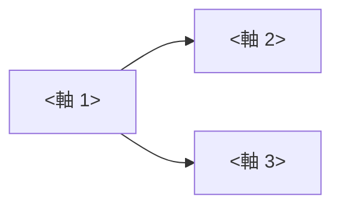
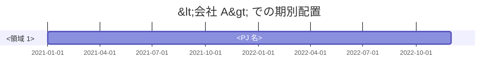

# 経歴書 (統合版) — <氏名> / <ハンドル>

本書は本ディレクトリ配下の各ドキュメントから事実ベースで統合した、 読み物としての経歴書である。 書式は [style-guide.md](../../_shared/style-guide.md) に従う。 基準日は **<yyyy-mm-dd>**。

> **この経歴書で扱う問い:**
> - <N> 年間で **どこに、 どのくらいの深さで** 投資してきたか
> - <N> PJ を **設計品質 × 人材レベル** でどう位置付けるか
> - **市場価値** はどの水準にあり、 **<次の昇格 / 転身>** に何が足りないか
> - **次半期で取りに行くべきこと** は何か

## 0. プロフィール

居住地 / 職種 / 所属 / 業務以外の活動 (個人 PJ / コミュニティ / 認定 / 発信) を 3-5 文で。

| 用途 | 識別子 |
|---|---|
| メール | <email> |
| GitHub (個人) | [@<user>](https://github.com/<user>) |
| GitHub (業務) | [@<user-corp>](https://github.com/<user-corp>) (任意) |
| X / Bluesky | [@<handle>](https://x.com/<handle>) |
| Zenn / Qiita / note | リンク + 本数 |
| YouTube / Twitch (任意) | リンク + 本数 / 登録 / 再生 |

---

## 1. エグゼクティブサマリ

過去 <N> 年間で <主要領域> を <N> 並列で運用してきた。 <N> PJ の 2 軸評価で **設計品質平均 <X>% / 人材レベル <Senior 等>** に位置し、 Staff 境界 <N> 指標で **<N>/<N> 完全達成** に到達している。

| 観点 | スコア | 解釈 | 確度 |
|---|---|---|---|
| 設計品質ヒット率 (N PJ 平均) | **X%** | 観測事実 |
| 人材レベル | **<Senior 等>** | 推定 |
| AI 協働運用 | **<Lv N/8>** | 推定 |
| 市場価格レンジ | **<X-Y 万>** | 推定 |

### 1.1 強みの輪郭 (mermaid 図 推奨)



### 1.2 弱みの構造的整理

| # | 未開拓項目 | 影響 |
|---|---|---|

---

## 2. <本業 / 会社 A> での業務

雇用形態の変遷を時系列で。 期別年表 (Mermaid gantt 推奨) + 期別の主役割表 + 評価できる案件の表。



詳細は [_research-areas/employment-<company>.md](_research-areas/employment-<company>.md) を参照。

### 2.x 主担当の進行中案件 (任意)

最新到達点となる PJ を 1-2 件、 数値根拠表で。

| 指標 | 値 |
|---|---:|

---

## 3. <副業 / 業務委託>

(該当があれば) 4 段階の温め期間 + 契約後の継続関与。

---

## 4. OSS / 上流コントリビュート

主要投稿先と継続期間。

| 上流 | 期間 | PR | merged | 主な内容 |
|---|---|---:|---:|---|

---

## 5. 個人プロジェクト

ジャンル別 (例: Web / AI / Tooling / ドメイン固有) に小見出し。 数値根拠を含む。

---

## 6. <ドメイン固有活動 A> (任意)

例: 競技 / 認定 / 教育 / 同人。

---

## 7. <N PJ> 2 軸評価レポート統合

`_pj-evaluations/` 配下の N 件を **設計品質 × 人材レベル** の 2 軸で統合する。

### 7.1 N PJ 分布図

```mermaid
quadrantChart
    title N PJ 統合プロット (基準日 yyyy-mm-dd)
    x-axis "設計品質低 (0%)" --> "設計品質高 (100%)"
    y-axis "Junior (0)" --> "Staff 境界 (1.0)"
    quadrant-1 "Staff × 高品質"
    quadrant-2 "Staff × 中品質"
    quadrant-3 "Mid × 中品質"
    quadrant-4 "Mid × 高品質"
    "<PJ 名>": [0.X, 0.Y]
```

### 7.2 ファミリ別統合スコア

| ファミリ | PJ 数 | 設計品質平均 | 人材レベル | 年収レンジ anchor |
|---|---:|---:|---|---|

### 7.3 Staff 境界 13 指標達成度

完全達成 N / 部分達成 N で、 Staff 要素を **約 X%** 満たしている。

### 7.4 推定年収レンジ

| anchor | レンジ | 根拠 |
|---|---|---|

### 7.5 成長軌道 (N 年スパン)

```
<年> <フェーズ名>: <主要 PJ>
    ↓ <強み軸の確立>
```

---

## 8. 留意点 / 観測限界

- 取得限界 (API レート / 最新ページのみ / NDA 範囲)
- 個人寄与割合の不確実性 (チーム PJ で本人担当が不明な範囲)
- 自己申告とアウトプットのトーン差
- ステータス変化の正確な日付 (開業 / 廃業 / 契約終了)
- 役職の正確な範囲

---

## 9. 関連ドキュメント

| ドキュメント | 用途 |
|---|---|
| [project-portfolio-<yyyy-mm>.md](project-portfolio-<yyyy-mm>.md) | 転職サービス入力欄向け |
| [<userid>-evaluation-<yyyy-qN>.md](<userid>-evaluation-<yyyy-qN>.md) | 2 軸評価レポート |
| [resume-<yyyymmdd>.md](resume-<yyyymmdd>.md) | 職務経歴書 PDF 写し |
| [README.md](README.md) | ナビゲーション |

### 領域別リサーチノート

[_research-areas/](./_research-areas/) 配下を参照。

### 中間成果物

[_intermediate/](./_intermediate/) 配下を参照 (引用専用)。

### PJ 別 2 軸評価詳細

[_pj-evaluations/](./_pj-evaluations/) + [_metadata.yaml](_pj-evaluations/_metadata.yaml)。

### 横断 reference

- 採点 rubric: [../../_shared/rubrics/](../../_shared/rubrics/)
- 採点ソース: [../../_shared/sources/](../../_shared/sources/)
- 執筆スタイル: [../../_shared/style-guide.md](../../_shared/style-guide.md)
